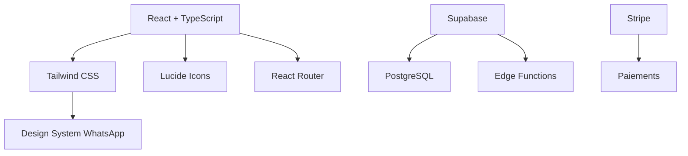
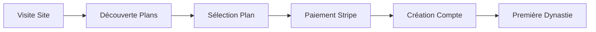
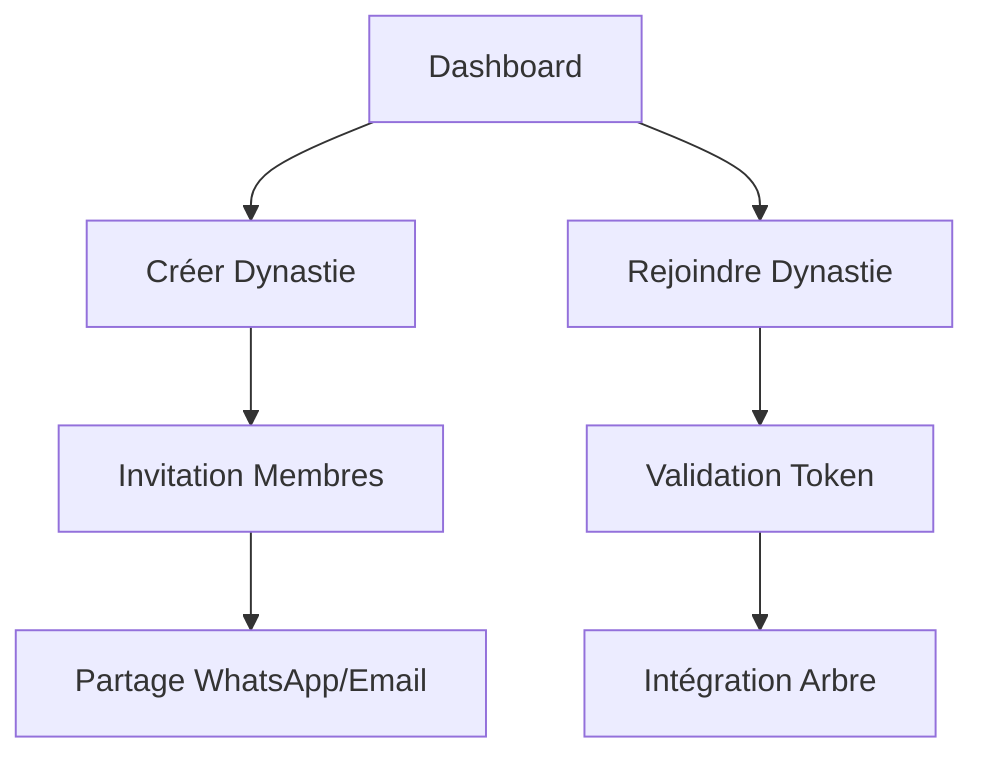
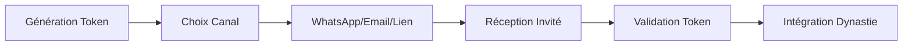

# 🌳 Documentation Application Généalogique Dynastique

## 📋 Table des Matières
1. [Vue d'ensemble](#vue-densemble)
2. [Architecture Technique](#architecture-technique)
3. [Charte Graphique](#charte-graphique)
4. [Composants Principaux](#composants-principaux)
5. [Workflow Utilisateur](#workflow-utilisateur)
6. [Pages et Navigation](#pages-et-navigation)
7. [Fonctionnalités Clés](#fonctionnalités-clés)
8. [Technologies Utilisées](#technologies-utilisées)
9. [Guide d'Utilisation](#guide-dutilisation)

---

## 🎯 Vue d'ensemble

### Objectif Principal
Application web permettant la création et gestion d'arbres généalogiques multi-dynasties avec système de paiement intégré et interface inspirée de WhatsApp.

### Fonctionnalités Principales
- **Gestion Multi-Dynasties** : Création et administration de plusieurs lignées familiales
- **Système d'Invitation** : Partage via WhatsApp, email ou lien direct
- **Paiements Intégrés** : 3 plans tarifaires (Basique, Premium, Dynasty Founder)
- **Interface WhatsApp** : Design familier et convivial
- **Animations Dynamiques** : Header avec texte animé et effets visuels

---

## 🏗️ Architecture Technique

### Stack Technologique


### Structure des Fichiers
```
src/
├── components/           # Composants réutilisables
│   ├── Header.tsx       # En-tête animé
│   ├── Footer.tsx       # Pied de page global
│   ├── DynastyCard.tsx  # Carte dynastie
│   ├── InviteSystem.tsx # Système d'invitation
│   ├── PaymentSection.tsx # Section paiement
│   └── ui/              # Composants UI Shadcn
├── pages/               # Pages principales
│   ├── Index.tsx        # Page d'accueil
│   └── NotFound.tsx     # Page 404
├── hooks/               # Hooks personnalisés
├── lib/                 # Utilitaires
└── styles/
    └── index.css        # Styles globaux + thème WhatsApp
```

---

## 🎨 Charte Graphique

### Palette de Couleurs WhatsApp
```css
:root {
  --whatsapp-green: #25D366;           /* Vert principal */
  --whatsapp-green-dark: #075E54;      /* Vert foncé */
  --whatsapp-green-secondary: #128C7E; /* Vert secondaire */
  --whatsapp-light: #ECE5DD;           /* Beige clair */
  --whatsapp-background: #F0F2F5;      /* Arrière-plan */
  --whatsapp-chat-bg: #E5DDD5;         /* Fond chat */
  --whatsapp-bubble-sent: #DCF8C6;     /* Bulle envoyée */
  --whatsapp-bubble-received: #FFFFFF; /* Bulle reçue */
}
```

### Gradients et Effets
- **Gradient Principal** : `linear-gradient(135deg, var(--whatsapp-green) 0%, var(--whatsapp-green-secondary) 100%)`
- **Bulles de Chat** : Bordures arrondies avec coins pointus
- **Animations** : Float, typing, bubble-pop, slide-in

### Typographie
- **Titres** : Font-bold, couleurs contrastées
- **Corps** : Text-gray-600/700 pour la lisibilité
- **Accents** : Couleurs WhatsApp pour les éléments interactifs

---

## 🧩 Composants Principaux

### 1. Header (Header.tsx)
**Fonctionnalités :**
- Texte animé rotatif (4 messages différents)
- Logo avec badge de notification
- Statistiques en temps réel (Dynasties/Membres)
- Boutons d'action (Chat Familial, Créer Dynastie)
- Barre de statut avec indicateurs d'activité

**Props :** Aucune (composant autonome)

### 2. Footer (Footer.tsx)
**Fonctionnalités :**
- Statistiques globales avec icônes
- Actions rapides (Calculateur, Partage, Privilèges)
- Liens légaux et contact
- Copyright et branding

**Props :** Aucune (composant autonome)

### 3. DynastyCard (DynastyCard.tsx)
**Fonctionnalités :**
- Affichage des informations dynastie
- Statuts visuels (active, premium, founder)
- Actions (Voir l'arbre, Rejoindre)
- Indicateurs d'activité

**Props :**
```typescript
interface DynastyCardProps {
  dynasty: {
    id: string;
    name: string;
    founder: string;
    members: number;
    createdAt: string;
    status: 'active' | 'premium' | 'founder';
    description?: string;
    avatar?: string;
  };
  onJoin?: (dynastyId: string) => void;
  onView?: (dynastyId: string) => void;
}
```

### 4. InviteSystem (InviteSystem.tsx)
**Fonctionnalités :**
- Génération de tokens d'invitation
- Partage multi-canal (WhatsApp, Email, Lien)
- Prévisualisation des invitations
- Statistiques d'invitation

**Props :**
```typescript
interface InviteSystemProps {
  dynastyId: string;
  dynastyName: string;
}
```

### 5. PaymentSection (PaymentSection.tsx)
**Fonctionnalités :**
- 3 plans tarifaires avec sélection
- Comparaison des fonctionnalités
- Intégration Stripe simulée
- Garanties et sécurité

**Props :** Aucune (gestion d'état interne)

---

## 🔄 Workflow Utilisateur

### 1. Parcours d'Inscription


### 2. Gestion des Dynasties


### 3. Système d'Invitation


---

## 📄 Pages et Navigation

### Page d'Accueil (/)
**Sections :**
1. **Header Animé** - Navigation et statistiques
2. **Hero Section** - Introduction et appel à l'action
3. **Fonctionnalités** - Présentation des capacités
4. **Plans Tarifaires** - PaymentSection avec 3 options
5. **Témoignages** - Retours utilisateurs
6. **Footer Global** - Liens et informations

**Navigation :**
- Header fixe avec scroll
- Boutons d'action contextuels
- Liens vers sections spécifiques

### Pages Futures (Non implémentées)
- `/dashboard` - Tableau de bord utilisateur
- `/dynasty/:id` - Détail d'une dynastie
- `/invite/:token` - Page d'invitation
- `/payment-success` - Confirmation paiement
- `/payment-canceled` - Annulation paiement

---

## ⚡ Fonctionnalités Clés

### 1. Système Multi-Dynasties
- **Création** : Formulaire avec nom, description, paramètres
- **Gestion** : Administration des membres et permissions
- **Visualisation** : Arbres généalogiques interactifs

### 2. Invitations Intelligentes
- **Génération** : Tokens sécurisés avec préfixes (INV_3, DYN_)
- **Multi-Canal** : WhatsApp Business API, SMTP, liens directs
- **Tracking** : Statistiques d'ouverture et conversion

### 3. Paiements Flexibles
- **Plans Échelonnés** :
  - Basique (5€/mois) : 1 dynastie, 50 membres
  - Premium (10€/mois) : 3 dynasties, illimité
  - Dynasty Founder (25€ unique) : Privilèges à vie
- **Intégration Stripe** : Checkout sécurisé, webhooks

### 4. Interface WhatsApp
- **Bulles de Chat** : Messages familiaux stylisés
- **Couleurs Cohérentes** : Palette verte reconnaissable
- **Animations Fluides** : Transitions naturelles

---

## 🛠️ Technologies Utilisées

### Frontend
- **React 18.3.1** - Librairie UI
- **TypeScript** - Typage statique
- **Tailwind CSS** - Framework CSS utilitaire
- **Lucide React** - Icônes vectorielles
- **React Router DOM** - Navigation SPA

### UI/UX
- **Shadcn/UI** - Composants pré-construits
- **Radix UI** - Primitives accessibles
- **Class Variance Authority** - Variants conditionnels
- **Tailwind Animate** - Animations CSS

### Développement
- **Vite** - Build tool moderne
- **ESLint** - Linting JavaScript/TypeScript
- **PostCSS** - Transformation CSS

### Intégrations Futures
- **Supabase** - Backend-as-a-Service
- **Stripe** - Processeur de paiements
- **WhatsApp Business API** - Notifications

---

## 📖 Guide d'Utilisation

### Pour les Développeurs

#### Installation
```bash
git clone <repository-url>
cd genealogy-app
npm install
npm run dev
```

#### Structure de Développement
1. **Composants** : Créer dans `/src/components/`
2. **Pages** : Ajouter dans `/src/pages/` + routing
3. **Styles** : Utiliser les tokens CSS WhatsApp
4. **Types** : Définir interfaces TypeScript

#### Bonnes Pratiques
- Respecter la charte graphique WhatsApp
- Utiliser les composants Shadcn/UI
- Implémenter les animations avec Tailwind
- Tester sur mobile et desktop

### Pour les Utilisateurs Finaux

#### Création de Dynastie
1. Visitez la page d'accueil
2. Sélectionnez un plan tarifaire
3. Complétez le paiement Stripe
4. Créez votre première dynastie
5. Invitez vos proches

#### Invitation de Membres
1. Accédez au système d'invitation
2. Choisissez le canal (WhatsApp/Email/Lien)
3. Personnalisez le message
4. Envoyez l'invitation
5. Suivez les statistiques

#### Gestion des Arbres
1. Ajoutez membres manuellement
2. Importez données existantes
3. Connectez les relations
4. Visualisez l'arbre complet
5. Exportez en PDF (Premium)

---

## 🔧 Configuration et Déploiement

### Variables d'Environnement
```bash
# Supabase
VITE_SUPABASE_URL=your_supabase_url
VITE_SUPABASE_ANON_KEY=your_supabase_anon_key

# Stripe
VITE_STRIPE_PUBLISHABLE_KEY=pk_test_...
STRIPE_SECRET_KEY=sk_test_...

# WhatsApp Business
WHATSAPP_BUSINESS_API_KEY=your_api_key
```

### Déploiement
```bash
# Build production
npm run build

# Preview local
npm run preview

# Deploy (via Lovable)
# Utiliser le bouton "Publish" dans l'interface
```

---

## 📈 Métriques et Analytics

### KPIs Clés
- Nombre d'utilisateurs inscrits
- Dynasties créées par mois
- Taux de conversion par plan
- Invitations envoyées/acceptées
- Temps moyen sur l'application

### Monitoring
- Erreurs JavaScript (Sentry)
- Performance Core Web Vitals
- Uptime API et services
- Feedback utilisateurs

---

## 🚀 Roadmap Future

### Phase 2 - Fonctionnalités Avancées
- [ ] Système d'authentification complet
- [ ] Base de données Supabase
- [ ] Intégration Stripe réelle
- [ ] WhatsApp Business API
- [ ] Arbre généalogique interactif

### Phase 3 - Optimisations
- [ ] PWA (Progressive Web App)
- [ ] Mode hors-ligne
- [ ] Notifications push
- [ ] Multi-langues
- [ ] Thèmes personnalisables

### Phase 4 - Intelligence
- [ ] IA pour suggestions de liens
- [ ] Reconnaissance faciale photos
- [ ] Analyse génétique (partenariats)
- [ ] Chatbot support famille
- [ ] Prédictions généalogiques

---

## 📞 Support et Contact

### Documentation Technique
- Repository GitHub : `<à définir>`
- Wiki développeurs : `<à créer>`
- API Documentation : `<à documenter>`

### Support Utilisateurs
- Email : support@genealogie-dynastique.fr
- Chat en ligne : Widget intégré
- FAQ : Section dédiée site web

---

*Documentation créée le $(date) - Version 1.0*
*Application Généalogique Dynastique - Lovable Project*
